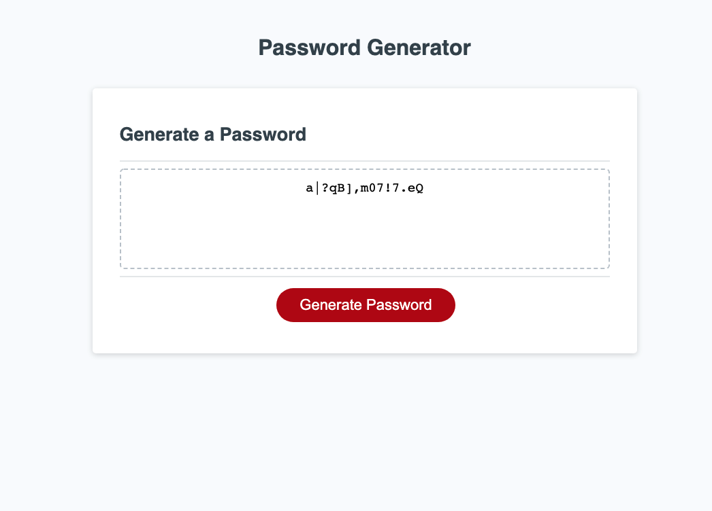

# password-generator

## Description
The purpose of this webpage is to create a randomly generated password. I allows the user to set their own parameters for the password by designationg its length, and selecting which character sets they want to include in the password, choosing lowercase letters, uppercase letters, numbers, and/or symbols. By using a random number generator the webpage's code is able to select from the designated character sets and produce a password on screen. 

## Installation
N/A

## Usage
The webpage can be found [here.](https://github.com/BradDWagner)

To use the password generator, first click on the red "Generate Password" button. A prompt window will then ask how long you want your password to be (enter a number between 8-128). A set of dialogue boxes will then follow asking what types of characters you would like to include in your password; you can choose to accept or deny each character set as you see fit as long as you accept at least one. Your generated password will then appear on screen.

## Credits
N/A

## License
Please refer to the LICENSE in the repo.